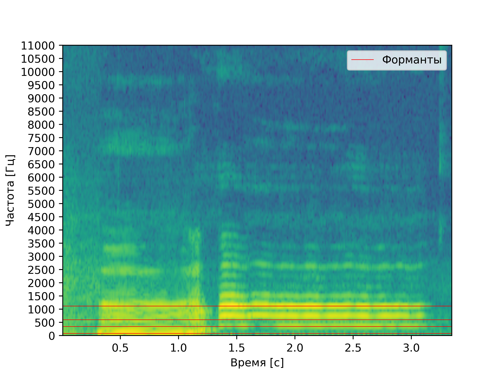
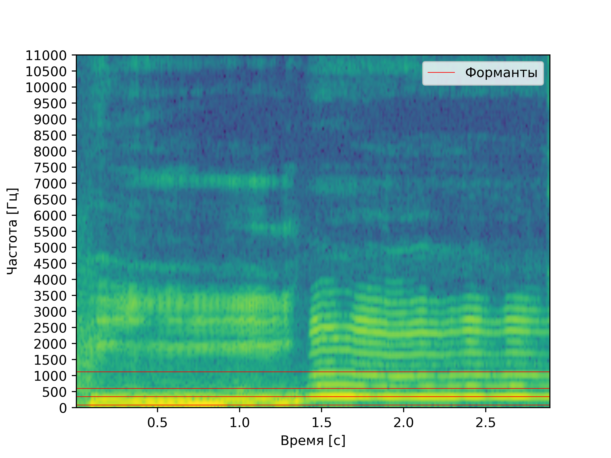
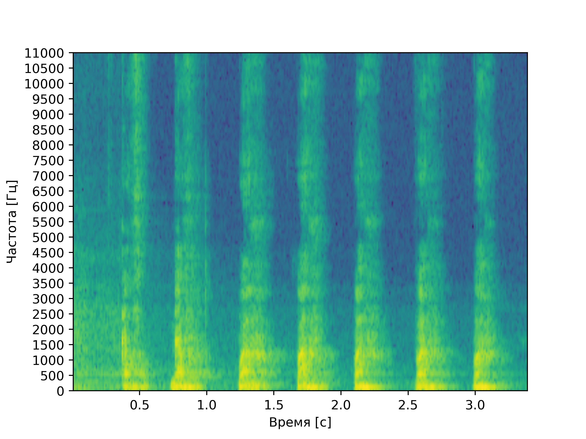

# Лабораторная работа №10. Обработка голоса
Лабораторная работа выполнялась для записи звуков "А" и "И" мужским голосом, а также для имитации собачьего лая.
Построены спектрограммы записи названных звуков и приведен их анализ: 
- Определение примерных минимальной и максимальной частот голоса
- Поиск тембрально окрашенного тона
- Поиск самых сильных формант

## Спектрограмма записи звука "А" по нарастающей

### Анализ
**Основной тон:** примерно 86 Гц

**Форманты:** форманта **FI** находится на частоте примерно 86 Гц, **FII** на частоте примерно 602 Гц,
**FIII** на частоте 861 Гц, **FIV** 1119 Гц

**Максимальная частоста:** 1894 Гц

## Спектрограмма записи звука "И" по нарастающей

### Анализ
**Основной тон:** примерно 86 Гц

**Форманты:** основная форманта **FI** находится на частоте примерно 86 Гц, далее, после провала прослеживается **FII** на частоте примерно 344 Гц, еще выше **FIII** на частоте 602 Гц, **FIV** 1119 Гц

**Максимальная частоста:** 3186 Гц

## Спектрограмма записи лая

**Максимальная частоста:** 1808 Гц

## Выводы

При сравнении спектрограмм звуков "И" и "А" можно увидеть, что и у первой и у второй значительная часть переносящих основную энергию формант сосредоточена в диапазоне 86 --- 1119 Гц. 