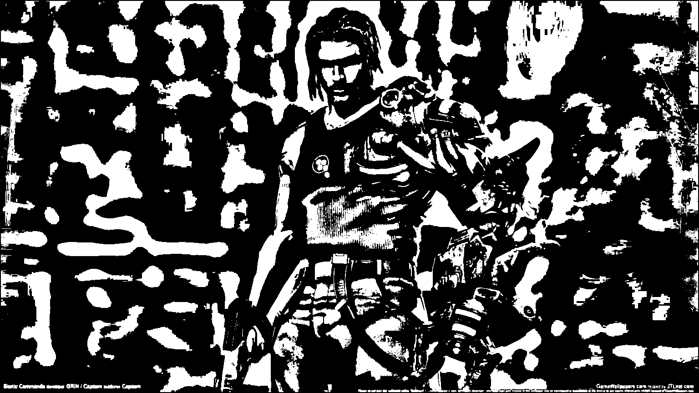

# Лабораторная работа №3. Фильтрация изображений и морфологические операции (Медианный фильтр.Разреженная маска — прямой крест) 

## Бинарное изображение игры
Исходное изображение:

Медианный фильтр.Разреженная маска — прямой крест

## Бинарное изобаржение текста:
Исходное изображение:

Медианный фильтр.Разреженная маска — прямой крест

## Бинаризованное изображение человеческого лица
Исходное изображение:

Медианный фильтр.Разреженная маска — прямой крест

## Бинаризованное фото тигра
Исходное изображение:

Медианный фильтр.Разреженная маска — прямой крест

## Выводы
В зависимости от характера изображения, мы можем судить подходит или не подходит ему морфологическое открытие. 
Обычно лучшие результаты оно показывает на изображениях с тонкими линиями. Медианный фильтр с 
разреженной маской помогает улучшить видимость деталей на изображениях с низким контрастом, не нарушая их структуру.
"Добавить с diff изобюражения"
