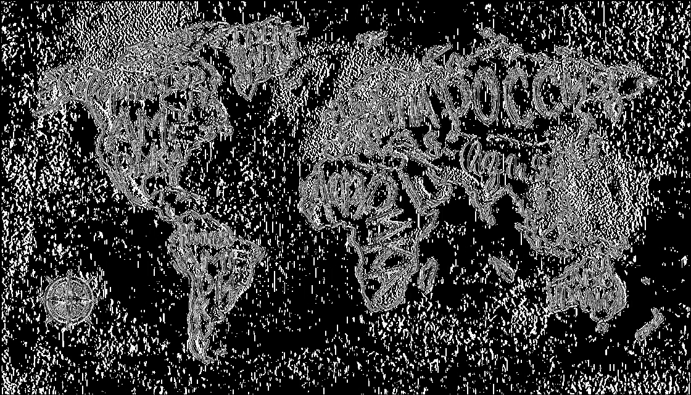

# Лабораторная работа №4. Выделение контуров на изображении.
Использовались оператор Круна и градиентная матрица $`G = |G_x| + |G_y|`$
## Фото пристани
Исходное изображение:

Градиент по Х:

Градиент по Y:

Градиентная матрица G:

Бинаризованная градиентная матрица G (Глобальная бинаризация, порог 15):

## карта
Исходное изображение:

Градиент по Х:

Градиент по Y:

Градиентная матрица G:

Бинаризованная градиентная матрица G(Глобальная бинаризация, порог 30):

## Фото текста
Исходное изображение:

Градиент по Х:

Градиент по Y:

Градиентная матрица G:

Бинаризованная градиентная матрица G(Глобальная бинаризация, порог 15):

## Выводы
Алгоритм выделения контуров оператором Круна хорошо себя показывает для векторных и мультяшных изображений, но не очень 
хорошо работает для фотографий с рукописным текстом. Для всех изображений видно, что выделение контуров намного лучше 
работает при глобальной пороговой бинаризации, потому что нет лишних шумов, как на изображении текста или пейзажах.
