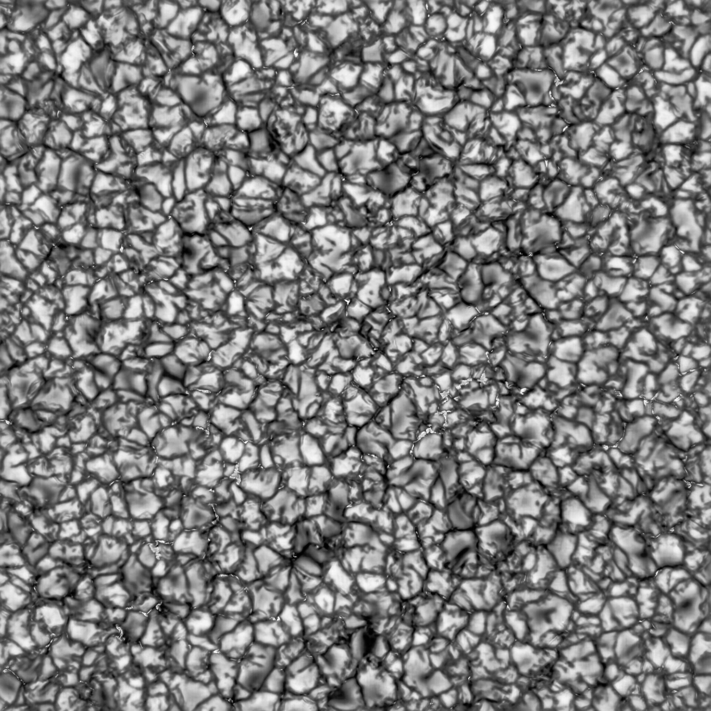
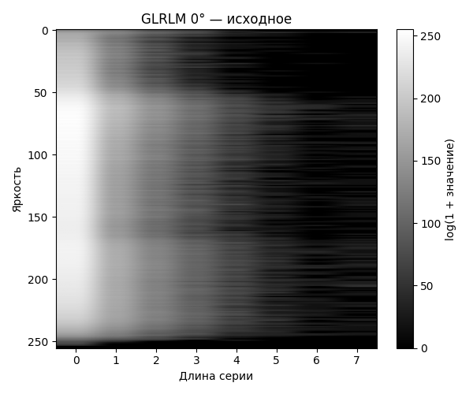
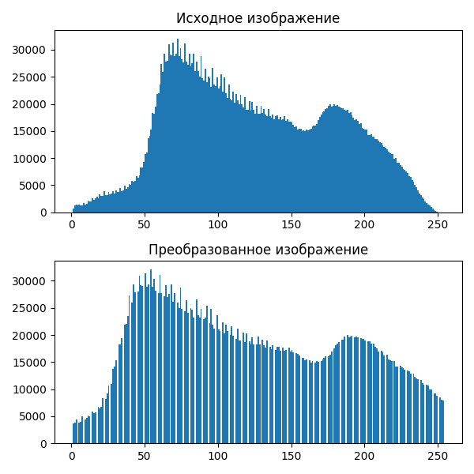
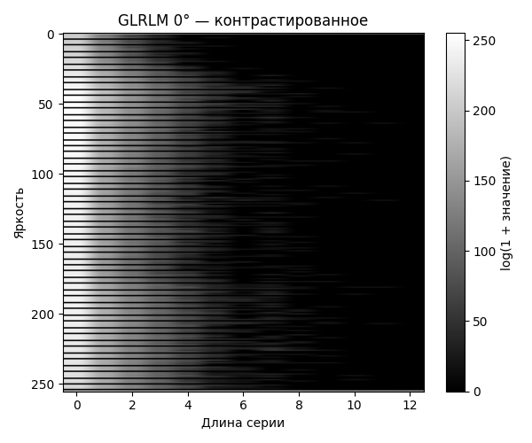

# Лабораторная работа №8. Текстурный анализ и контрастирование.
- Матрица длин серий (GLRLM)
- Расчет признаков GLNU и RLNU 
- Линейное контрастирование
- Матрицы длин серий(логарифмической нормировки) для полутоновых и контрастированных полутоновых изображений

##  Изображение льва
### Исходное:

### Полутоновое:

### Матрица длин серий

### Признаки
GLNU: 16315.30

RLNU: 1617055.72

### Гистограммы

### Констрастированное полутоновое изображение

### Матрица длин серий для контрастированного изображения

### Контрастированные признаки
GLNU (contrasted): 16843.97

RLNU (contrasted): 1550661.72

#
##  Изображение поверхности Солнца
### Исходное:

### Полутоновое:

### Матрица длин серий

### Признаки
GLNU: 18285.26

RLNU: 2966180.02

### Гистограммы

### Констрастированное полутоновое изображение 

### Матрица длин серий для контрастированного изображения

### Контрастированные признаки
GLNU (contrasted): 18808.20

RLNU (contrasted): 2859456.97

## Выводы
Линейное контрастирование  уменьшает яркость изображения в целом, а так же может помочь выделить текстуры объектов, несильно отличающихся по яркости. Матрица длин серий при этом меняется; параметр GLNU (Неоднородность яркости, Gray-level
nonuniformity), как правило, увеличивается, а параметр RLNU (Неоднородность длин серий, Run length
nonuniformity) уменьшается.
